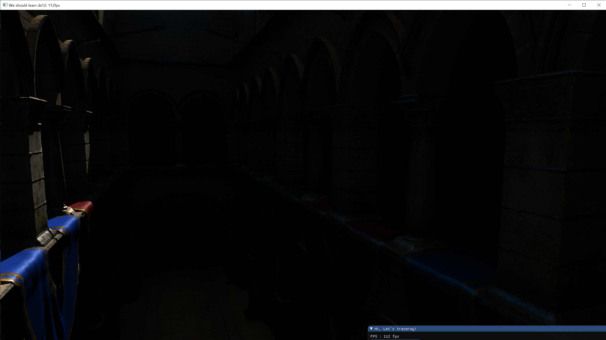

# Corona
Corona pandemic made me to spend some time for this hobby project. That is the reason why the name of the project is Corona.

# DX12
I tried to best practice of dx12 api usage.

# DXR
There are several dxr tutorials and examples. But I couldn't find one that is simple and includes complete sets of raytracing usage.
This is basically simplified version of Q2RTX in terms of raytracing. which means it has most of raytracing feature(shadow/gi/..).
I hope it helps someone to understand how dxr renderer looks like.

## Screenshots

## Build
* Go to build directory.
* premake5.exe vs2017( or vs2019)
* Build & run!

## Third-party libs
* [enkiTS](https://github.com/dougbinks/enkiTS)
* [glm](https://glm.g-truc.net/0.9.9/index.html)
* [NV Aftermath](https://developer.nvidia.com/nvidia-aftermath)
* [premake](https://premake.github.io/)
* [imgui gizmo(compatible with glm)](https://github.com/DarisaLLC/imGuIZMO-1)

## Useful link
* Tone map
	* [Baking lab](https://github.com/TheRealMJP/BakingLab/blob/master/BakingLab/ToneMapping.hlsl)
* DX12
	* [MJP github](https://github.com/TheRealMJP)
* DXR
	* [Instance property](https://developer.nvidia.com/rtx/raytracing/dxr/DX12-Raytracing-tutorial/Extra/dxr_tutorial_extra2_simple_lighting)
	* [Adam Mars intro dxr](https://github.com/acmarrs/IntroToDXR)
* Denoising
	* [Raytracing best practice](https://www.gdcvault.com/play/1026721/RTX-Ray-Tracing-Best-Practices)
	* [Raytracing reflection in youngblood](https://www.gdcvault.com/play/1026723/Ray-Traced-Reflections-in-Wolfenstein)
	* [Q2RT Indirect diffuse denoiser](https://github.com/NVIDIA/Q2RTX/blob/master/src/refresh/vkpt/shader/asvgf_lf.comp)
	* [Q2 RT GTC presentation from Alexey Pantellev](https://developer.nvidia.com/gtc/2019/video/S91046/video)
	* [Q2 RT GDC presentation from Alexey Pantellev](https://www.youtube.com/watch?v=FewqoJjHR0A)
	* [MS RTAO SFGV denoiser](https://github.com/microsoft/DirectX-Graphics-Samples/tree/master/Samples/Desktop/D3D12Raytracing/src/D3D12RaytracingRealTimeDenoisedAmbientOcclusion)
* fbx file
	* [https://github.com/derkreature/IBLBaker](https://github.com/derkreature/IBLBaker)

* Pef
	* [Nsight](https://news.developer.nvidia.com/nsight-graphics-2020-2/)
	
