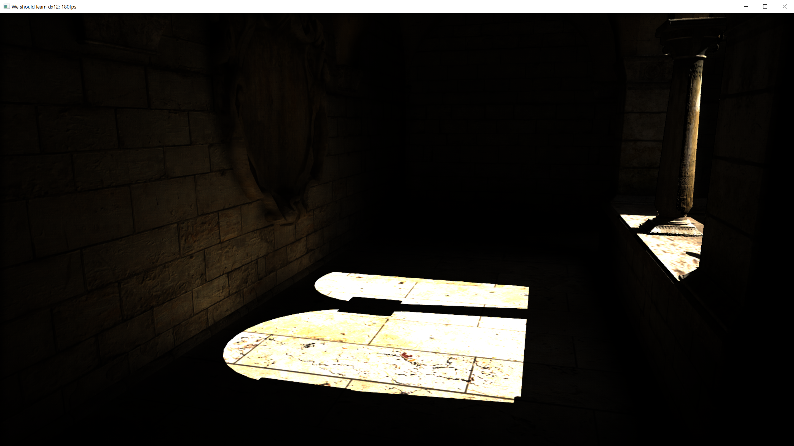

# DX12 & DXR test framework
This project is for dx12 & dxr learning. I am trying to test best practice implementation(resource binding, descriotpr allocation, multi-thread command submission, etc....)

## DX12 Topic
* Easy resource binding interface.
* Descriptor allocation.
	* Ring buffer.
* Multi threaded mesh rendering. (this is broken temporarily)
* Descriptor table usage.
* Memory residency.

## Screenshots

## DXR Topic
* How to make resource binding easier.
	* Root signature.
	* Shader table.

## Non-DX Topic
* Temporal AA

## Build
* Go to build directory.
* premake5.exe vs2017

## Third-party libs
* [enkiTS](https://github.com/dougbinks/enkiTS)
* [glm](https://glm.g-truc.net/0.9.9/index.html)
* [NV Aftermath](https://developer.nvidia.com/nvidia-aftermath)
* [premake](https://premake.github.io/)

## Useful link
* DX12
	* [MJP github](https://github.com/TheRealMJP)
* DXR
	* [Instance property](https://developer.nvidia.com/rtx/raytracing/dxr/DX12-Raytracing-tutorial/Extra/dxr_tutorial_extra2_simple_lighting)
	* [Adam Mars intro dxr](https://github.com/acmarrs/IntroToDXR)

* Denoising
	* [Q2RT Indirect diffuse denoiser](https://github.com/NVIDIA/Q2RTX/blob/master/src/refresh/vkpt/shader/asvgf_lf.comp)
	* [Q2 RT GTC presentation from Alexey Pantellev](https://developer.nvidia.com/gtc/2019/video/S91046/video)
	* [Q2 RT GDC presentation from Alexey Pantellev](https://www.youtube.com/watch?v=FewqoJjHR0A)
	* [MS RTAO SFGV denoiser](https://github.com/microsoft/DirectX-Graphics-Samples/tree/master/Samples/Desktop/D3D12Raytracing/src/D3D12RaytracingRealTimeDenoisedAmbientOcclusion)
* fbx file
	* [https://github.com/derkreature/IBLBaker](https://github.com/derkreature/IBLBaker)

## Fun bug story
* Shader table should be ring buffer if it changes!.
	
