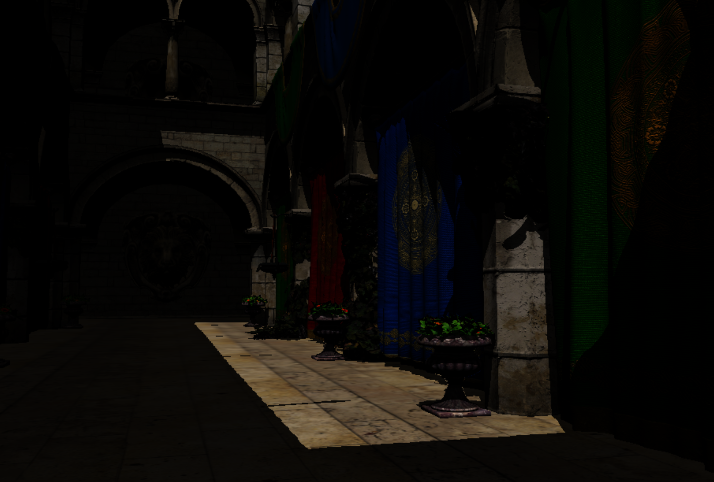

# DX12 & DXR test framework
This project is for dx12 & dxr learning. Quite  unorgnized for now. I am trying to test best practice implementation(resource binding, dynamic descriotpr allocation, multi-thread command submission, etc....)

## DX12
* Helper classes for resource management.
* Easy resource binding interface.
* ~~Dynamic descriptor allocation strategy.~~
* Multi threaded mesh rendering.

## DXR
* Shadow
* ~~Reflection~~

## Build
* I used to use CMake before, considering to migrate to other build system.
* Currently, it is just a vs solution.

## Third-party libs
* [enkiTS](https://github.com/dougbinks/enkiTS)
* [glm](https://glm.g-truc.net/0.9.9/index.html)
* [NV Aftermath](https://developer.nvidia.com/nvidia-aftermath)
* [Assimp](https://github.com/assimp/assimp)

## Usefule link
* [NVIDIA dxr tutorials](https://github.com/NVIDIAGameWorks/DxrTutorials)
	* Most clean & easy to understand.
* [Microsoft dxr tutorial](https://github.com/microsoft/DirectX-Graphics-Samples/tree/master/Samples/Desktop/D3D12Raytracing)
	* More complicated effects like shadow & reflection.
	* More complicated binding.(global root signature or descriptor table in shadertable).
* [MJP github](https://github.com/TheRealMJP)
	* Excellent dx12 reference implementation.
